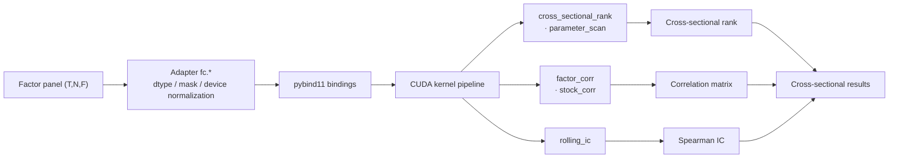
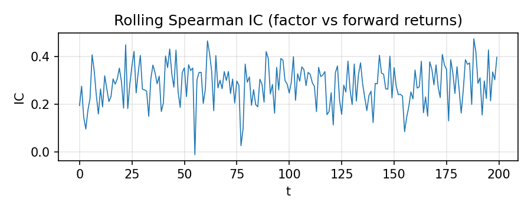
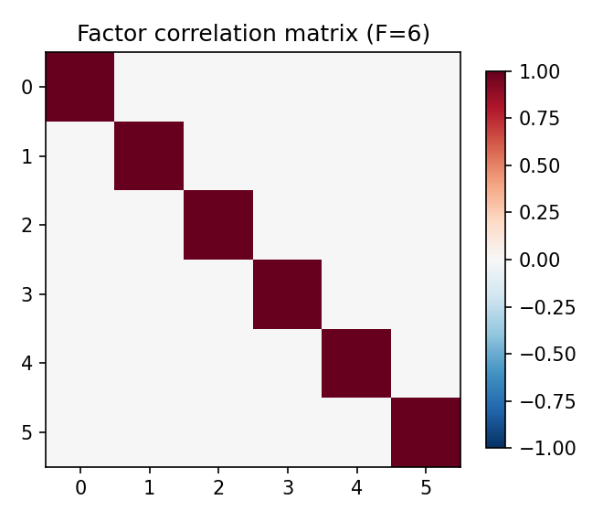
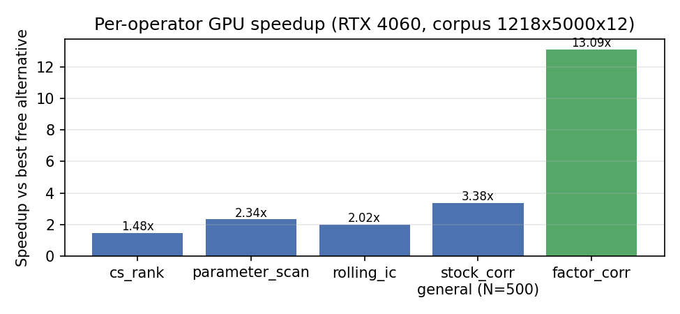

# factor-cuda — CUDA-Accelerated Cross-Sectional Factor Analysis

> [简体中文](README.md) · [English](README.en.md) · [繁體中文](README.zh-Hant.md)

> GPU-accelerated cross-sectional analysis for quantitative factors — cross-sectional ranking, correlation, IC, and parameter scans.
> Together with ashare-mcp (data acquisition) and ml-quant-trading (factor production), it forms a free A-share quantitative-research pipeline.
> **This project does NOT compute factors, backtest, or fetch data.**

## Status

**Released v1.1.0 (2026-08-08)** — PoC items ①–④ closed out; Phases 1–4 complete + P3 adapter auto-cache.
- The operation-semantics contract is frozen (L0 Spec, CLAUDE.md); all 150 tests passed locally on GPU / 3 skipped (GitHub Actions runs the CPU/contract arm without GPU: 85 passed); all six Phase 3 acceptance gates are marked PASS.
- Phase 4 benchmark end-to-end **~3.0×** (vs the best same-semantics free alternative; below the pre-registered 5× superiority threshold → **registered as negative result NRR-2026-024**).
- The memory-model "divisible" trilogy (F-blocking / streaming / N-blocking) is validated as a PoC / memory-feasibility path: factor F=128 model peak 12,645.61 MiB (over budget) → streaming measured 7,079.75 MiB (fits).

## Features

GPU-accelerated cross-sectional operators (pybind11 bindings + pure-Python backends):

| Operator | Output | dtype | Backend |
|----------|--------|-------|---------|
| `cross_sectional_rank` | (T,N) ranks 1..K | f32 | GPU-only |
| `parameter_scan` | 4×(T,N) ranks | f32 | GPU-only |
| `factor_corr` | (F,F) correlation matrix | f32/f64 | CPU / CUDA |
| `stock_corr` | (N,N) correlation matrix | f32/f64 | CPU / CUDA |
| `rolling_ic` | (T,) Spearman IC | f32/f64 | CPU / CUDA (auto via device=None) |

Also: a static GPU-memory budget model (`docs/memory_budget_v1.json`), workspace allocation caching, adapter-level auto-cache (transparent to `fc.*` callers; release device buffers via `fc.clear_workspaces()`), corpus parity verification.

## Quick Start

> Source build (Windows 10/11 + CUDA Toolkit 13.3 + VS2026 MSVC + Python 3.12 + CMake/Ninja; environment in `docs/support_matrix.json`). After building the pybind11 extension modules (`-DBUILD_PYBIND11=ON`), `fc.*` is callable (auto GPU when CUDA is available).

```bash
git clone https://github.com/redamancy231-create/factor-cuda
cd factor-cuda
cmake -S . -B build -DBUILD_PYBIND11=ON -DPython_EXECUTABLE=<python3.12.exe>
cmake --build build --target factor_cuda_pybind factor_corr_pybind
```

```python
import numpy as np
import fc                       # auto GPU when CUDA is available

X = np.random.randn(1218, 5000).astype(np.float32)               # (T, N) factor panel
mask = np.ones((1218, 5000), dtype=bool)

rank = fc.cross_sectional_rank(X, mask)                          # cross-sectional rank (GPU)
ic = fc.rolling_ic(X, np.random.randn(1218, 5000), min_valid=30) # rolling Spearman IC
corr = fc.factor_corr(np.random.randn(1218, 5000, 4))            # factor correlation (F×F)
```

## Architecture



## Build

- Environment support matrix in `docs/support_matrix.json` (single source of truth; tested CUDA Toolkit 13.3 / VS2026 MSVC 19.51 / Python 3.12.7 / compute capability 8.9, single-arch declaration).
- CMake + Ninja (C++20); PoC tools built via `pwsh -NoProfile -File _build_poc3.ps1 <target>`.

## Performance

RTX 4060 Laptop (sm_89), corpus 1218×5000×12, vs the best same-semantics free alternative:

| Operator | Speedup |
|----------|---------|
| End-to-end (committed / fresh) | 3.04× / 2.94× |
| `factor_corr` | 13.09× |
| `stock_corr` general (N=500 / N=2000) | 3.38× / 2.31× |
| `parameter_scan` | 2.34× |
| `rolling_ic` | 2.02× |
| `cs_rank` | 1.48× |

> Below the pre-registered 5× target → negative result registered as [NRR-2026-024](https://github.com/redamancy231-create/negative-results-registry/tree/main/entries/NRR-2026-024). See `benchmarks/results/phase4_bench_v1.md`.

## Examples

Real operator outputs on a deterministic synthetic panel (RTX 4060 Laptop):







## Documentation Index

### Users & Community

| File | Content |
|------|---------|
| `docs/support_matrix.json` | build/runtime environment support matrix (single source of truth) |
| `CONTRIBUTING.md` | contribution guide |
| `SUPPORT.md` | support |
| `SECURITY.md` | security policy (vulnerability reporting) |

### Contract & API

| File | Content |
|------|---------|
| `CLAUDE.md` | L0 Spec (operation-semantics contract / success criteria / pitfalls, frozen) |
| `docs/memory_budget_v1.json` | static GPU-memory budget model |
| `FUTURE_WORK.md` | future work directions (optimization / feature / engineering candidates, evidence-ranked) |
| `CHANGELOG.md` | change log |
| `PLAN.md` | historical design document (superseded) |

### Performance Evidence

| File | Content |
|------|---------|
| `benchmarks/results/phase4_bench_v1.md` | Phase 4 E2E benchmark (3.04× / 2.94×) |
| `benchmarks/results/acceptance_v1.md` | Phase 2-3 acceptance (six gates PASS) |
| `benchmarks/results/ws_py_cache_v1.md` | Adapter auto-cache speedup (rolling_ic 1.35× / cs_rank 1.20×) |

## Competitors & Baselines

- **QuantGplearn**: genetic-programming factor mining, Torch GPU backend — the strongest candidate for the fair baseline in PoC ② (optional local baseline, not bundled)
- **equity-factor-lab**: a full factor research platform, a reference for bias-control practices

## Related Projects

- [ashare-mcp](https://github.com/redamancy231-create/ashare-mcp) — A-share data acquisition
- [ml-quant-trading](https://github.com/redamancy231-create/ml-quant-trading) — factor production
- [etf-pattern-match-pybind11](https://github.com/redamancy231-create/etf-pattern-match-pybind11) — a reference project using the same stack (pybind11 + CMake)
- [negative-results-registry](https://github.com/redamancy231-create/negative-results-registry) — negative-result registry (NRR-2026-024)
- [redamancy231-create](https://github.com/redamancy231-create/redamancy231-create) — personal profile / full project index

*Not investment advice.*
