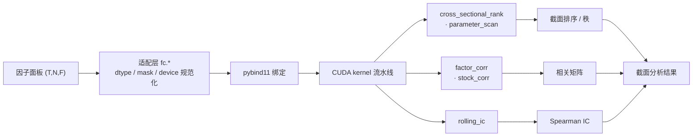

# factor-cuda — CUDA 因子截面分析加速

> [简体中文](README.md) · [English](README.en.md) · [繁體中文](README.zh-Hant.md)
>
> 
> 
> 
> 
> 

> GPU 加速的量化因子**截面分析**工具——截面排序、相关性、IC、参数扫描。
> 与 ashare-mcp（数据获取）、ml-quant-trading（因子生产）组成 A 股量化研究免费管线。
> **本项目不做因子计算、不做回测、不做数据获取。**

## 状态

**已发布 v1.0.1（2026-08-08）**——PoC ①-④ 全闭合 + Phase 1-4 完成。
- 操作语义契约已冻结（L0 Spec，CLAUDE.md）；Phase 2 验收测试套件本地 GPU **126 passed / 3 skipped**（GitHub Actions 无 GPU 跑 CPU/契约臂 75 passed）；Phase 3 验收六门全 PASS。
- Phase 4 benchmark 端到端 **~3.0×**（vs 同语义最佳免费替代；未达 5× 优势门槛 → **负结果已登记 NRR-2026-024**）。
- 内存模型「可分块」三件套（F-blocking / streaming / N-blocking）已验证（PoC/内存可行性路径）：factor F=128 模型峰值 12,645.61 MiB 超预算 → streaming 实测 7,079.75 MiB fits。

## 功能

GPU 加速截面分析算子（pybind11 绑定 + 纯 Python 后端）：

| 算子 | 说明 |
|------|------|
| `cross_sectional_rank` | 稳定序数截面排序（float32，CUB radix sort） |
| `parameter_scan` | 方向×mask 4 组参数扫描（单次 H2D） |
| `factor_corr` | 因子相关矩阵（F×F，含 Kahan 重算触发 + F-blocking/streaming） |
| `stock_corr` | 股票相关矩阵（N×N，fast/general 双路径 + N-blocking） |
| `rolling_ic` | 滚动 Spearman IC（float64 统一路径） |

配套：显存静态预算模型（`docs/memory_budget_v1.json`）、workspace 分配缓存、corpus parity 验证。

## 快速开始

> 源码构建（Windows 10/11 + CUDA Toolkit 13.3 + VS2026 MSVC + Python 3.12 + CMake/Ninja；环境见 `docs/support_matrix.json`）。扩展模块经 pybind11 绑定（`-DBUILD_PYBIND11=ON`）构建后，`fc.*` 即可调用（CUDA 可用时自动走 GPU）。

```bash
git clone https://github.com/redamancy231-create/factor-cuda
cd factor-cuda
cmake -S . -B build -DBUILD_PYBIND11=ON -DPython_EXECUTABLE=<python3.12.exe>
cmake --build build --target factor_cuda_pybind factor_corr_pybind
```

```python
import numpy as np
import fc                       # CUDA 可用时自动走 GPU

X = np.random.randn(1218, 5000).astype(np.float32)               # (T, N) 因子面板
mask = np.ones((1218, 5000), dtype=bool)

rank = fc.cross_sectional_rank(X, mask)                          # 截面排序（GPU）
ic = fc.rolling_ic(X, np.random.randn(1218, 5000), min_valid=30) # 滚动 Spearman IC
corr = fc.factor_corr(np.random.randn(1218, 5000, 4))            # 因子相关矩阵 (F×F)
```

## 架构



## 构建

- 环境支持矩阵见 `docs/support_matrix.json`（单一真源；实测 CUDA Toolkit 13.3 / VS2026 MSVC 19.51 / Python 3.12.7 / compute capability 8.9，单架构声明）。
- CMake + Ninja（C++20）；PoC 工具经 `pwsh -NoProfile -File _build_poc3.ps1 <target>` 构建。

## 性能

RTX 4060 Laptop（sm_89），corpus 1218×5000×12，vs 同语义最佳免费替代：

| 算子 | 加速比 |
|------|-------|
| 端到端（committed / fresh） | 3.04× / 2.94× |
| `factor_corr` | 13.09× |
| `stock_corr` general（N=500 / N=2000） | 3.38× / 2.31× |
| `parameter_scan` | 2.34× |
| `rolling_ic` | 2.02× |
| `cs_rank` | 1.48× |

> 未达 5× 优线 → 负结果登记 [NRR-2026-024](https://github.com/redamancy231-create/negative-results-registry/tree/main/entries/NRR-2026-024)。详见 `benchmarks/results/phase4_bench_v1.md`。

## 文档索引

| 文件 | 内容 |
|------|------|
| `PLAN.md` | 方案设计（定位/市场验证/技术架构/实现阶段/风险） |
| `CLAUDE.md` | 项目规范 L0 Spec（操作语义契约/停止条件/成功标准/评估/可复现/坑位） |
| `CHANGELOG.md` | 变更记录 |
| `docs/support_matrix.json` | 构建/运行环境支持矩阵 |
| `docs/memory_budget_v1.json` | 显存静态预算模型（含实测闭合） |
| `reviews/` | 独立审查报告（gitignored，不发布） |

## 竞品与对照

- **QuantGplearn**：遗传规划因子挖掘，Torch GPU 后端——PoC ② 公平基线最强对照候选（可选本地基线，非随包分发）
- **equity-factor-lab**：完整因子研究平台，bias 控制范式参考

## 相关项目

- [ashare-mcp](https://github.com/redamancy231-create/ashare-mcp) — A 股数据获取
- [ml-quant-trading](https://github.com/redamancy231-create/ml-quant-trading) — 因子生产
- [etf-pattern-match-pybind11](https://github.com/redamancy231-create/etf-pattern-match-pybind11) — 同技术栈（pybind11+CMake）参考
- [negative-results-registry](https://github.com/redamancy231-create/negative-results-registry) — 负结果登记（NRR-2026-024）
- [redamancy231-create](https://github.com/redamancy231-create/redamancy231-create) — 个人主页 / 全部项目索引

*非投资建议。*
