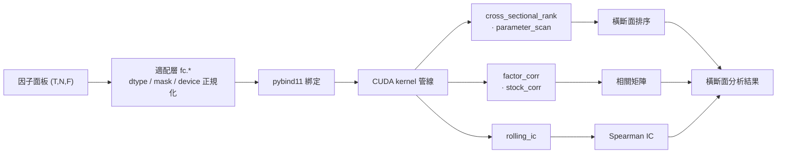

# factor-cuda — CUDA 因子橫斷面分析加速

> [简体中文](README.md) · [English](README.en.md) · [繁體中文](README.zh-Hant.md)

> GPU 加速的量化因子**橫斷面分析**工具——橫斷面排序、相關性、IC、參數掃描。
> 與 ashare-mcp（資料取得）、ml-quant-trading（因子生產）組成 A 股量化研究免費管線。
> **本專案不做因子計算、不做回測、不做資料取得。**

## 狀態

**已發佈 v1.1.0（2026-08-08）**——PoC ①–④ 均已完成驗證 + Phase 1-4 完成 + P3 適配層自動快取。
- 操作語義契約已凍結（L0 Spec，CLAUDE.md）；測試套件本機 GPU **150 項通過 / 3 項跳過**（GitHub Actions 無 GPU 跑 CPU/契約臂 85 項通過）；Phase 3 六項驗收關卡全數 PASS。
- Phase 4 benchmark 端到端 **~3.0×**（vs 同語義最佳免費替代；未達 5× 優勢門檻 → **負結果已登記 NRR-2026-024**）。
- 記憶體模型「可分塊」三件套（F-blocking / streaming / N-blocking）已驗證（PoC/記憶體可行性路徑）：factor F=128 模型峰值 12,645.61 MiB 超預算 → streaming 實測 7,079.75 MiB 符合預算。

## 功能

GPU 加速橫斷面分析運算子（pybind11 綁定 + 純 Python 後端）：

| 運算子 | 輸出 | dtype | backend |
|------|------|-------|---------|
| `cross_sectional_rank` | (T,N) 秩 1..K | f32 | GPU-only |
| `parameter_scan` | 4×(T,N) 秩 | f32 | GPU-only |
| `factor_corr` | (F,F) 相關矩陣 | f32/f64 | CPU / CUDA |
| `stock_corr` | (N,N) 相關矩陣 | f32/f64 | CPU / CUDA |
| `rolling_ic` | (T,) Spearman IC | f32/f64 | CPU / CUDA（device=None 自動） |

配套：GPU 記憶體靜態預算模型（`docs/memory_budget_v1.json`）、workspace 分配快取、**適配層自動快取（fc 透明，`fc.clear_workspaces()` 釋放）**、corpus parity 驗證。

## 快速開始

> 原始碼建置（Windows 10/11 + CUDA Toolkit 13.3 + VS2026 MSVC + Python 3.12 + CMake/Ninja；環境見 `docs/support_matrix.json`）。擴充模組經 pybind11 綁定（`-DBUILD_PYBIND11=ON`）建置後，`fc.*` 即可呼叫（CUDA 可用時自動走 GPU）。

```bash
git clone https://github.com/redamancy231-create/factor-cuda
cd factor-cuda
cmake -S . -B build -DBUILD_PYBIND11=ON -DPython_EXECUTABLE=<python3.12.exe>
cmake --build build --target factor_cuda_pybind factor_corr_pybind
```

```python
import numpy as np
import fc                       # CUDA 可用時自動走 GPU

X = np.random.randn(1218, 5000).astype(np.float32)               # (T, N) 因子面板
mask = np.ones((1218, 5000), dtype=bool)

rank = fc.cross_sectional_rank(X, mask)                          # 橫斷面排序（GPU）
ic = fc.rolling_ic(X, np.random.randn(1218, 5000), min_valid=30) # 滾動 Spearman IC
corr = fc.factor_corr(np.random.randn(1218, 5000, 4))            # 因子相關矩陣 (F×F)
```

## 架構



## 建置

- 環境支援矩陣見 `docs/support_matrix.json`（單一真實來源；實測 CUDA Toolkit 13.3 / VS2026 MSVC 19.51 / Python 3.12.7 / compute capability 8.9，僅宣告單一架構）。
- CMake + Ninja（C++20）；PoC 工具經 `pwsh -NoProfile -File _build_poc3.ps1 <target>` 建置。

## 效能

RTX 4060 Laptop（sm_89），corpus 1218×5000×12，vs 同語義最佳免費替代：

| 運算子 | 加速比 |
|------|-------|
| 端到端（committed / fresh） | 3.04× / 2.94× |
| `factor_corr` | 13.09× |
| `stock_corr` general（N=500 / N=2000） | 3.38× / 2.31× |
| `parameter_scan` | 2.34× |
| `rolling_ic` | 2.02× |
| `cs_rank` | 1.48× |

> 未達 5× 優勢門檻 → 負結果登記 [NRR-2026-024](https://github.com/redamancy231-create/negative-results-registry/tree/main/entries/NRR-2026-024)。詳見 `benchmarks/results/phase4_bench_v1.md`。

## 範例

確定性合成面板上的真實算子輸出（RTX 4060 Laptop）：


## 文件索引

### 使用者與社群

| 文件 | 內容 |
|------|------|
| `docs/support_matrix.json` | 建置/執行環境支援矩陣（單一真實來源） |
| `CONTRIBUTING.md` | 貢獻指南 |
| `SUPPORT.md` | 支援說明 |
| `SECURITY.md` | 安全政策（漏洞報告） |

### 契約與 API

| 文件 | 內容 |
|------|------|
| `CLAUDE.md` | L0 Spec（操作語義契約/成功標準/常見陷阱，凍結） |
| `docs/memory_budget_v1.json` | GPU 記憶體靜態預算模型 |
| `CHANGELOG.md` | 變更記錄 |
| `PLAN.md` | 歷史方案文件（superseded） |

### 效能證據

| 文件 | 內容 |
|------|------|
| `benchmarks/results/phase4_bench_v1.md` | Phase 4 E2E benchmark（3.04× / 2.94×） |
| `benchmarks/results/acceptance_v1.md` | Phase 2-3 驗收（六關全 PASS） |
| `benchmarks/results/ws_py_cache_v1.md` | 適配層自動快取收益（rolling_ic 1.35× / cs_rank 1.20×） |

## 競品與對照

- **QuantGplearn**：遺傳規劃因子探勘，Torch GPU 後端——PoC ② 公平基線最強對照候選（可選本機基線，不隨套件提供）
- **equity-factor-lab**：完整因子研究平台，偏誤控制方法的參考

## 相關專案

- [ashare-mcp](https://github.com/redamancy231-create/ashare-mcp) — A 股資料取得
- [ml-quant-trading](https://github.com/redamancy231-create/ml-quant-trading) — 因子生產
- [etf-pattern-match-pybind11](https://github.com/redamancy231-create/etf-pattern-match-pybind11) — 同技術堆疊（pybind11+CMake）的參考專案
- [negative-results-registry](https://github.com/redamancy231-create/negative-results-registry) — 負結果登記（NRR-2026-024）
- [redamancy231-create](https://github.com/redamancy231-create/redamancy231-create) — 個人主頁 / 全部專案索引

*非投資建議。*
